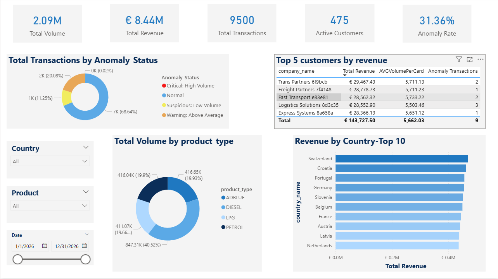

# Fuel Card Sales & Anomaly Detection Dashboard

## 📊 Project Overview
This project focuses on analyzing fuel transaction data across 11 European markets. The goal was to monitor sales performance and identify potential fraud using advanced data transformation and visualization techniques. 

The dashboard provides executive-level insights into revenue, volume, and customer activity, with a specialized focus on security through an automated anomaly detection system.

## 🔒 Data Privacy & Authenticity
**Important:** To ensure data privacy and comply with security standards, all datasets used in this project are **synthetic and randomly generated**. No real customer or corporate data was used. This project is a demonstration of data modeling, SQL logic, and visualization skills.

## 🛠 Tech Stack
* **SQL:** * **Schema Design:** Creating the database structure from scratch (Tables, Keys).
    * **Data Generation:** Developing scripts to generate synthetic transactions and simulating errors for testing.
    * **Data Cleaning:** Handling simulated errors, data consistency, and cleaning procedures.
    * **Advanced Analytics:** Anomaly detection logic using CTEs and Window Functions.
* **Power BI / DAX:** Data modeling, advanced DAX measures (`CALCULATE`, `KEEPFILTERS`), and interactive UI design.

## 🚀 Key Features
* **Full Data Pipeline:** End-to-end process from raw data generation in SQL to final business insights in Power BI.
* **Executive KPI Tracking:** Real-time monitoring of Total Revenue (€ 8.44M), Volume, and Transactions.
* **Dynamic Anomaly Detection:** Custom SQL logic flagging "Critical" and "Suspicious" transactions based on volume deviations.
* **Revenue at Risk:** Financial impact analysis of suspicious transactions to prioritize security audits.

## 📈 Dashboard Preview

## 💡 Business Insights
* **Operational Efficiency:** Identified 5% inactive customer base, preventing skewed performance data.
* **Risk Management:** Highlights that over 31% of transactions require audit due to high-volume anomalies.
* **Fraud Prevention:** Identified high-risk client behaviors for immediate review.

## 📁 Files in Repository
* `Fuel_Analytics_Report.pbix`: The full interactive Power BI report.
* `01_Schema_Setup.sql`: Creating the database structure.
* `02_Data_Generation.sql`: Scripts for synthetic data and error simulation.
* `03_Data_Cleaning.sql`: Data transformation and consistency checks.
* `04_Anomaly_Detection.sql`: Advanced analytics and fraud detection logic.
* `README.md`: Project documentation and business summary.
